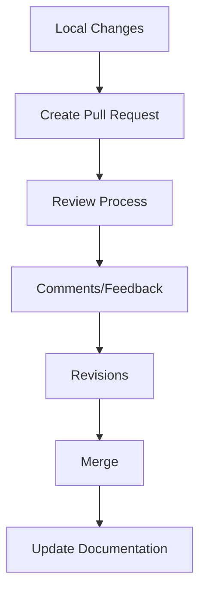

> This article was originally published on [Empathy.co Engineering Blog](https://engineering.empathy.co/collaborative-architecture-diagrams/) and has been updated with current practices for 2025.

## Motivation

Architecture diagrams should be visible to everyone in the company, as Trust is one of our core principles. Ensuring visibility creates a single source of truth where changes can be tracked and revisions can be made. This approach aligns Engineering, Growth, and Product teams, providing a common process for defining diagrams.

### Current Diagram Types

We maintain multiple diagrams for various layers:
- Product Vision Diagram: Created in Diagrams.net, owned by Product team
- Architecture Logical Perspective: Miro diagram for customer presentations and workshops
- Frontend Architecture Diagram: Created in Diagrams.net, owned by Frontend teams

### Pain Points

1. **Location Uncertainty**
   - Difficult to locate diagrams
   - No centralized repository
   
2. **Validation Issues**
   - Diagrams lack formal validation
   - No revision process
   
3. **Change Management**
   - No standardized tracking
   - Version control challenges

## The Solution

### Collaborative Approach

Implementing collaborative architecture diagrams helps visualize how elements within the organization interact by providing:
- Wider process visibility
- Single source of truth
- Improved collaboration
- Enhanced communication
- Change tracking
- Review processes

### Why GitHub?

While Confluence could track changes by adding diagrams to pages, we prefer GitHub for:
- Pre-merge review capability
- Code-based validation
- Version control
- Pull request workflow

## Implementation

### Validation Process 



### Technical Setup

1. **Repository Structure**

```bash
architecture/
├── product/
│ ├── vision.drawio
│ └── vision.svg
├── backend/
│ ├── logical.drawio
│ └── logical.svg
└── frontend/
│ └── components.drawio
│ └── components.svg
```

2. **File Formats**
- Source: `.drawio` files
- Export: `.svg` for markdown embedding
- Additional: PNG for broader compatibility

### Editing Options

1. **Local Development**
- Install Diagrams.net desktop app
- Clone repository
- Make changes locally
- Submit pull request

2. **Web-based Editing**
- Use github.dev
- Integrated diagrams.net editor
- Direct commits or PRs

## Team Responsibilities

### Engineering Teams
- Update diagrams during task completion
- Propose changes via pull requests
- Review design transformations

### Design Team
- Transform technical diagrams
- Enhance visual impact
- Maintain brand consistency

### Growth Team
- Request design modifications
- Validate business alignment
- Ensure clarity for stakeholders

### Product Team
- Maintain product vision diagrams
- Align with roadmap
- Ensure documentation accuracy

## Best Practices

1. **Version Control**

git:content/posts/collaborative-architecture-diagrams.md

Branch naming convention
- feature/update-backend-diagram
- fix/correct-frontend-flow
- docs/update-product-vision

2. **Review Process**
- Clear description of changes
- Visual diff when possible
- Link to related issues/tickets
- Stakeholder approval

3. **Documentation**
- README in each directory
- Change log maintenance
- Link to related documentation
- Usage guidelines

## Benefits

1. **Transparency**
- Company-wide visibility
- Clear change history
- Accessible to all teams

2. **Collaboration**
- Asynchronous work
- Easy review process
- Cross-team alignment

3. **Quality**
- Validated changes
- Consistent style
- Professional output

## Tools We Use

1. **Primary Tools**
- [Diagrams.net](https://www.diagrams.net/)
- [Excalidraw](https://excalidraw.com/)
- GitHub

2. **Supporting Tools**
- GitHub Actions for automation
- VS Code with extensions
- Markdown editors

## Conclusion

Using GitHub as a single source of truth for architecture diagrams provides:
- Centralized storage
- Easy accessibility
- Company-wide visibility
- Streamlined workflow
- Simple discovery process

The Engineering department recommends using Diagrams.net or Excalidraw for formal diagrams, with the crucial requirement being the upload of source files to the repository.

## Resources

- [Revision Handling for Diagrams](https://drawio-app.com/why-you-need-revision-handling-for-your-diagrams/)
- [Edit Diagrams with GitHub.dev](https://www.diagrams.net/blog/edit-diagrams-with-github-dev)

## About the Author

I'm a Platform Engineer Architect specializing in cloud-native technologies and engineering leadership. I focus on building efficient, collaborative engineering processes and documentation.

[Connect with me on LinkedIn](https://www.linkedin.com/in/ramiroalvfer/) or [contact me](/contact) for more information.