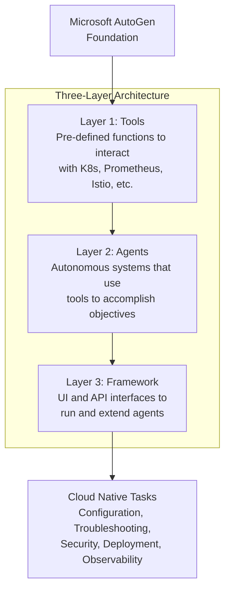

## Motivation

I usually read the CNCF blog on a weekly basis, and a [post about KAgent](https://www.cncf.io/blog/2025/04/15/kagent-bringing-agentic-ai-to-cloud-native/) caught my attention. KAgent is an open source framework that enables DevOps/Platform engineers to run agentic AI within Kubernetes environments to autonomously solve complex cloud native operational challenges. With AI being everywhere lately, I wanted to test it in an Internal Developer Platform and see what benefits it could provide to all platform user personas.

After checking the KAgent documentation, the tool looks very promising. Do you have connection issues? Would you like to perform a performance analysis of your app? Do you need help setting alerts? Are you having trouble with your traffic setup? KAgent could solve all these questions easily through agents.

KAgent is not just a chatbot; it reasons and iterates to solve questions autonomously, taking direct actions and 
improving productivity by resolving issues.

KAgent is built on Microsoft's AutoGen, and consists of three layers (Tools, Agents, and Framework) that work together to handle configuration, troubleshooting and security tasks. 





All right, I want to test it!

## Getting Started

Easy! Deploy the CRDs, then deploy KAgent. The documentation recommends using the kagent-cli, but I prefer to deploy it using Helm to maintain consistency with the rest of the apps.

```sh
helm install kagent-crds oci://ghcr.io/kagent-dev/kagent/helm/kagent-crds \
    --namespace kagent

helm install kagent oci://ghcr.io/kagent-dev/kagent/helm/kagent \
    --namespace kagent \
    --set providers.default=ollama \
    --set providers.ollama.config.host=https://localhost:8082/llm --set providers.ollama.model="qwen2.5:32b-instruct-q8_0" --set contrib.agents.observability.prometheus.url="http://prometheus.monitoring:9090/api/v1" --set providers.openAI.apiKey=<OpenAIApiKey>
```

You can set up various providers: OpenAI, Ollama, Anthropic, or AzureOpenAI. The compatibility with Ollama opens the door to experimenting with multiple deployed models. Supported models can be found [here](https://github.com/kagent-dev/autogen/blob/main/python/packages/autogen-ext/src/autogen_ext/models/ollama/_model_info.py#L228).

## Setup

The model I chose to test with Ollama is [Qwen2.5-32B-Instruct](https://huggingface.co/Qwen/Qwen2.5-32B-Instruct), which offers advanced capabilities, long context handling, and open source availability, making it well-suited for KAgent's tools and agents.

## Kubernetes Agent

Explore Kubernetes without knowing the commands - this is particularly useful for beginners starting to interact with Kubernetes clusters. For experts, it can help with complex issues.


## Observability Agent

This is a great troubleshooting helper for observability concerns.


## Documentation Agent

Internal Developer Platforms usually have documentation repositories about observability, best practices, APIs, and more. So why not use KAgent to interact with this documentation?

Essentially, we crawl a local directory containing our documentation, store the content in a vector database, and then ask questions that the agent can answer based on this information.

Writing an effective system prompt is key to building a useful agent. After confirming that everything works at a basic level, it's necessary to iterate on the prompt to help the agent understand how to behave.

```mermaid
flowchart TB
    subgraph "Documentation Sources"
        A1["Local Directory"] 
        A2["Public URL"]
        A3["GitHub Repository"]
    end
    
    subgraph "KAgent Documentation Agent"
        B["Crawler"]
        C["Vector Database<br>(sqlite-vec)"]
        D["System Prompt"]
        E["AI Agent<br>(Qwen2.5-32B-Instruct)"]
    end
    
    subgraph "Interaction"
        F["User Question"]
        G["Agent Response<br>with Documentation Links"]
    end
    
    A1 --> B
    A2 --> B
    A3 --> B
    
    B -->|"Extract content"| C
    D -->|"Define behavior"| E
    C -->|"Provide context"| E
    F -->|"Query"| E
    E -->|"Answer based on docs"| G
  ```

The agents come with refined prompts by default. For new agents, I recommend starting simple and using tools like Perplexity, ChatGPT, or Claude to help write better prompts.

Following the documentation, I chose to use a local directory in this case. You can choose between using a public URL, a GitHub repo (be mindful of throttling limits), or a local directory to crawl your documentation and store the content in a sqlite-vec database.

After following the documentation and setting everything up, does it work?


Yes! It works! :rocket:


As you can see, it works extremely well. The agent uses the documentation to answer questions properly and provides links for deeper exploration.

## Summary

KAgent has a promising future ahead. It can be used to extend Internal Developer Platform capabilities and enhance productivity.

What I love:
- Multiple AI providers available. It doesn't limit you to the most well-known providers, giving you the flexibility to use various models.
- Useful pre-configured agents. No need to spend excessive time setting up agents to communicate with your Kubernetes cluster.
- Easy integration with your Kubernetes cluster and popular cloud-native tools.

The community around KAgent is working at an incredibly fast pace. At the time this article was written, [a new integration with Slack had just been published](https://kagent.dev/docs/examples/slack-a2a). I can't wait to test it!

The future looks brilliant for the Cloud Native ecosystem and the addition of agents to interact with your Kubernetes cluster and applications autonomously.

## Resources

- [System Prompts](https://kagent.dev/docs/getting-started/system-prompts)
- [Documentation Agent](https://kagent.dev/docs/examples/documentation)
- [CNCF Blog](https://www.cncf.io/blog/2025/04/15/kagent-bringing-agentic-ai-to-cloud-native/)
- [Slack Agent To Agent](https://kagent.dev/docs/examples/slack-a2a)
- [Qwen2.5-32B-Instruct](https://huggingface.co/Qwen/Qwen2.5-32B-Instruct)

## About the Author

I'm a Platform Engineer Architect specializing in cloud-native technologies and engineering leadership. I focus on building efficient, collaborative engineering processes and documentation. I'm a Golden Kubestronaut with a passion for Cloud Native technologies.

[Connect with me on LinkedIn](https://www.linkedin.com/in/ramiroalvfer/) or [contact me](/contact) for more information.

